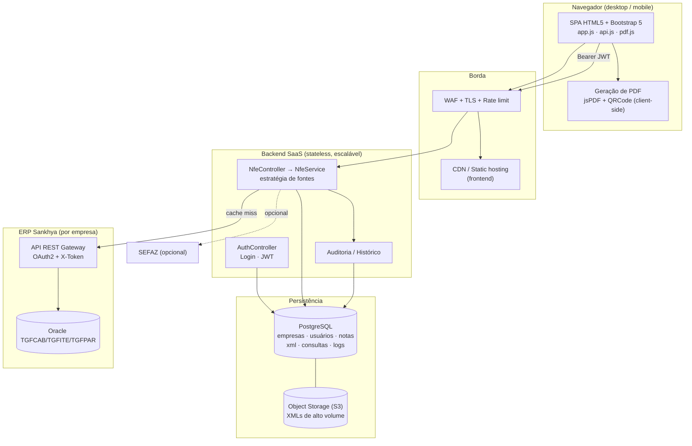
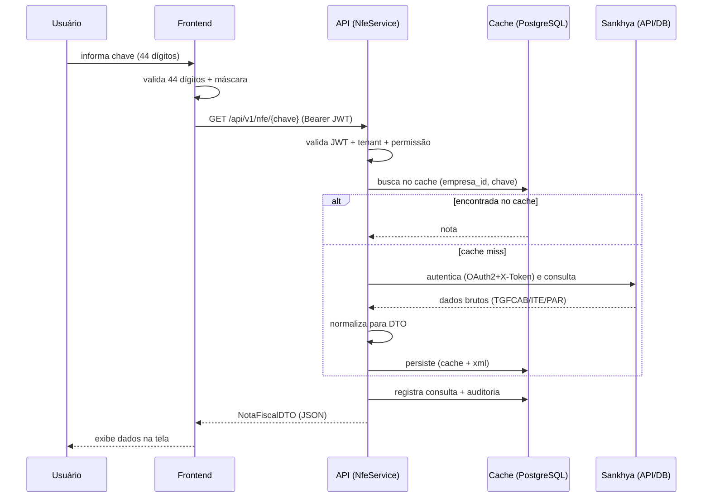

# Arquitetura — Consulta NF-e SaaS (integrado ao Sankhya)

> Documento de arquitetura da solução SaaS para consulta de NF-e pela chave de
> acesso e geração de PDF, tendo o **ERP Sankhya** como fonte primária de dados.

---

## 1. Visão geral e princípio de projeto

O objetivo é **consultar uma NF-e pela chave de acesso (44 dígitos), exibir os
dados e gerar um PDF** — de forma rápida, segura e escalável, pronta para
comercialização como SaaS multiempresa.

**Princípio central:** a Sankhya é a *fonte de verdade*, mas **não deve ser
consultada diretamente a cada request**. A solução usa um **repositório
próprio (cache) de NF-e** que é populado sob demanda e/ou por sincronização.
Isso desacopla o SaaS da disponibilidade/latência do ERP, protege o Oracle de
carga externa e viabiliza a escala horizontal.

```
Usuário → Frontend (HTML5/Bootstrap) → API REST (Spring Boot)
             ↓                              ↓
         Gera PDF               Cache próprio (PostgreSQL)
       (client-side)                        ↓ (miss)
                               Integração Sankhya (API/DB Oracle)
                                            ↓ (opcional)
                                         SEFAZ
```

---

## 2. Diagrama de componentes



---

## 3. Onde estão os dados no Sankhya

| Dado | Tabela / campo Sankhya |
|---|---|
| Chave de acesso | `TGFCAB.CHAVENFE` |
| Número / Série | `TGFCAB.NUMNOTA` / `TGFCAB.SERIENOTA` (⚠️ `NUNOTA` é chave **interna**, não o número impresso) |
| Data de emissão | `TGFCAB.DTNEG` (e `DTFAT`) |
| Status | `TGFCAB.STATUSNOTA` (`L`=Liberada/autorizada) |
| Valor total | `TGFCAB.VLRNOTA` |
| Protocolo / autorização | `TGFCAB.NUMEROPROT` / `TGFCAB.DHPROT` |
| Emitente / Destinatário | `TGFPAR` via `TGFCAB.CODPARC` (`NOMEPARC`, `CGC_CPF`) |
| Produtos / qtd / valores | `TGFITE` via `NUNOTA` (`CODPROD`, `QTDNEG`, `VLRUNIT`, `VLRTOT`) |
| Impostos | `TGFITE` (bases/valores ICMS, IPI, PIS, COFINS) |
| XML completo | Monitor NF-e / armazenamento de XML do Sankhya (arquivo autorizado) |

> Join nota × item: por `NUNOTA`. Join nota × financeiro: por `NUMNOTA+SERIENOTA`
> (a `TGFFIN` **não** tem `NUNOTA`).

---

## 4. Fluxo de consulta da NF-e



## 5. Fluxo de geração de PDF

```mermaid
sequenceDiagram
    participant U as Usuário
    participant F as Frontend (pdf.js)
    U->>F: clica "Gerar PDF"
    F->>F: jsPDF monta cabeçalho Voke + dados + produtos + totais
    F->>F: QRCode.js gera QR da chave → PNG
    F->>F: autoTable renderiza itens; adiciona rodapé + data
    F-->>U: download NFe_<numero>_<chave>.pdf
```

**Por que PDF no cliente?** Zero carga no servidor, resposta instantânea e sem
tráfego de arquivos. Para PDF fiel ao DANFE oficial (layout SEFAZ), a evolução
é gerar server-side a partir do XML autorizado (ver `PLANO-IMPLANTACAO.md`).

---

## 6. Arquitetura SaaS (transversais)

| Requisito | Como é atendido |
|---|---|
| **Multiempresa** | Discriminador `empresa_id` em todas as tabelas + **Row Level Security** no PostgreSQL. Credenciais Sankhya por empresa. |
| **Usuários / permissões** | RBAC com perfis ADMIN, OPERADOR, CONSULTA, AUDITOR (ver `SecurityConfig`). |
| **Histórico de consultas** | Tabela `consulta` (quem, quando, resultado, fonte, gerou PDF). |
| **Logs de auditoria** | Tabela `log_auditoria` append-only (LOGIN, CONSULTA_NFE, GERAR_PDF, CRUD). |
| **Escalabilidade** | Backend **stateless** (JWT) → escala horizontal atrás de load balancer; cache reduz chamadas ao ERP; XML pesado em object storage. |
| **Segurança LGPD** | Cifra de segredos (AES-GCM/secrets manager), minimização, retenção configurável por plano, trilha de auditoria, TLS ponta a ponta. |

---

## 7. Segurança

- **Login + JWT** stateless; refresh token com rotação.
- **Senhas** com BCrypt (fator 12) — nunca em texto puro.
- **RBAC** por perfil (autorização por rota).
- **SQL Injection**: consultas parametrizadas / JPA; a chave é sanitizada para
  44 dígitos numéricos na borda (`replaceAll("\\D","")`) antes de qualquer uso.
- **XSS**: `escapeHtml` no frontend em todo dado renderizado + CSP `default-src 'self'`.
- **Transporte**: TLS obrigatório, HSTS, WAF e rate limiting na borda.
- **Isolamento multi-tenant**: o `empresa_id` vem **sempre do JWT**, nunca do
  path/body — evita acesso cruzado entre empresas.

---

## 8. Estrutura de pastas

```
nfe-consulta-saas/
├── README.md
├── docs/
│   ├── ARQUITETURA.md            ← este documento
│   ├── INTEGRACAO-SANKHYA.md     ← trade-offs das abordagens de integração
│   ├── PLANO-IMPLANTACAO.md      ← roadmap de implantação
│   └── CUSTOS-HOSPEDAGEM.md      ← estimativa de custos SaaS
├── db/
│   └── schema.sql                ← modelo relacional (PostgreSQL) + RLS
├── frontend/                     ← SPA HTML5 (funcional, modo demo embutido)
│   ├── index.html
│   └── assets/{css,js}/...
└── backend/                      ← skeleton Spring Boot (Java 21)
    ├── pom.xml
    └── src/main/java/tech/voke/nfe/
        ├── controller/  service/  integration/
        ├── security/    dto/      (config/ model/ repository/)
```

Ver `INTEGRACAO-SANKHYA.md` para a comparação detalhada das quatro formas de
integrar ao Sankhya e a recomendação.
